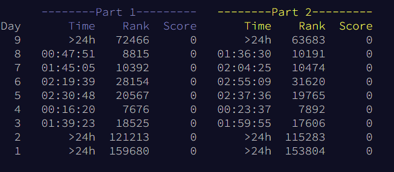

All my solutions for Advent of Code 2022!

This is my first time participating in AoC and I chose to do it in Java :)

After Day 9, I got too busy to continue, but I still had fun. I have not had any previous competitive programming experience before.

Days where I started as soon as the puzzle released:
4, 7, 8

Personal stats (keep in mind the above!):
